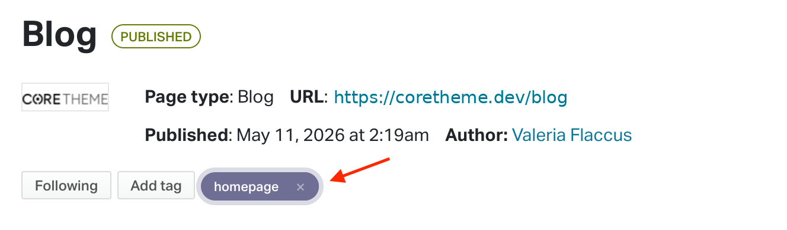
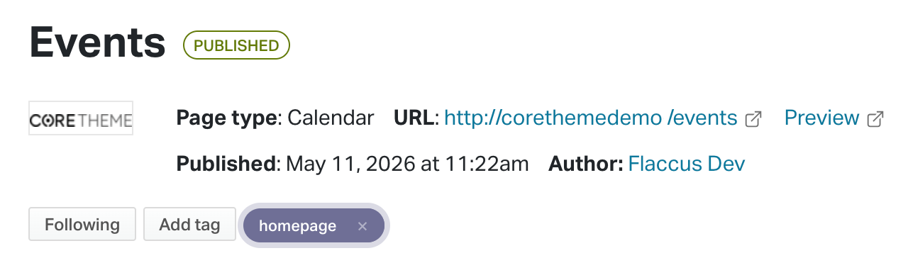

# Site sections and page types

## **Homepage**

### **How homepage section work**

The homepage is designed to display excerpts from other pages on your site. This allows you to feature key pages, such as the Blog, Events, Donation, Endorsement, Survey, or Suggestion Box pages, directly on the homepage. 

To show a page excerpt on the homepage, go to the page you want to feature and add the tag homepage. Once the tag has been added, the theme will automatically pull that page into the homepage and display it as a homepage section.

### **Adding a video hero section to the homepage**

To add a video excerpt to the homepage, first upload the video to YouTube.

Then, create a **Basic page** in NationBuilder and add the YouTube video URL under **Page settings \> Headline**.

If you want to display overlay text on top of the video, add that text to the page’s **content editor**.

Once the video URL and content have been added, tag the Basic page with **homepage**. The theme will then use that page to display the video section on the homepage.

### **Adding a CTA hero section to the homepage**

To add a CTA hero section to the homepage, create a **Basic page** type and tag the page with **homepage** and **cta**. 

To set the CTA button label, go to **Settings \> Title** and enter the text you want to display on the button.

To set the CTA button link, go to **Settings \> Headline** and enter the URL you want to redirect users to.

To set the section content, go to **Content** and enter the text you want to display.

To set the background image, go to **Files** and upload the image you want to display.

Guidelines: the image file must be jpg or png format and landscaped.

### **Adding a hero section to the homepage with an image and text**

To add an Image \+ Text hero section to the homepage, create a Basic page type and tag the page with homepage.

Add the image by navigating to Files and upload the image you want to display.

Guidelines: the image file must be jpg or png format and landscaped.

By default, the image will appear on the left hand side with the text on the right hand side. To change this around, add the tag **image-right**.

### **Changing the background color of homepage excerpts**

Homepage excerpts can have their own background color, which is controlled by adding a dedicated color tag to the page.

Page types that support a background color are: Basic (no CTA, no video), Event, FAQ and Feedback.

To change the background color of an excerpt, add the relevant background color tag to the page that is being displayed on the homepage.

For example, adding the tag **color\_bg\_home\_excerpt\_secondary\_dark** will apply the theme’s **secondary dark** color to that homepage excerpt.

This allows you to adjust the look of individual homepage sections while still using the color palette defined in the theme.

The default list of available colors can be found within the core-variables.scss (starting at line 48).

\[add screenshot\]

To add a new color, declare a new variable with the prefix `--color-` . The value must be your desired hex code.  
For example: if you want to create a lilac color, add  `--color-lilac: #D7C5E9;`  
`To` assign this background color to the section, tag the page with color\_bg\_home\_excerpt\_lilac

### **Using the homepage as an excerpt container**

By default, the homepage can display its own content from the NationBuilder content editor, along with any homepage excerpts pulled from other pages.

If you want the homepage to act only as a container for excerpts, add the tag **hp\_container** to the homepage.

When this tag is added, the homepage will hide its own content and only display the excerpts from pages tagged with **homepage**. This is useful when you want to build the homepage entirely from reusable page sections instead of adding content directly to the homepage editor.

## **Footer**

### **Adding contact links to footer**

To add contact links to the footer, go to the **Homepage**, then open the **Subpages** tab and click **New subpage**.

Create a new page using the **Redirect** page type and set the page slug to **contact\_us**.

This redirect page is used to display the footer contact icons. 

The envelope icon will link to the URL added under the Redirect page’s “**URL to redirect to”** field. You can use this to link to a contact page, email form, or any other preferred contact URL.

The map pin and phone icons are pulled from your nation’s contact details. To update these, go to **Contacts and billing \> Contacts \> Account contact** in your NationBuilder control panel and add your address and phone number.

### **Adding social media links to the footer**

To add social media links to the footer, go to the **Homepage**, then open the **Subpages tab** and click **New subpage**.  
Create a new page using the **Redirect page** type. This redirect page will be used to display the relevant social media icon in the footer.  
The page name and slug should match the social media platform you want to show. Use the following options:

| Social media platform | Page name | Slug |
| :---- | :---- | :---- |
| Facebook | Facebook | facebook |
| Instagram | Instagram | instagram |
| LinkedIn | LinkedIn | linkedin |
| X / Twitter | Twitter | twitter\_x |
| Youtube | Youtube | youtube |

### **Adding a newsletter signup form**

To display a newsletter signup field in the footer, go to **Pages** \> **New page** in your NationBuilder control panel.  
Create a new page using the Signup page type and set the page slug to **newsletter\_join**.  
Once this page has been created with the correct slug, the theme will automatically display the newsletter signup field in the footer, allowing visitors to join your list by entering their email address.

### Adding Footer legal links

To add legal links to the footer, create a **Basic** page for each legal or policy page you want to include.

The theme will automatically display these pages as links in the footer when they use the correct slugs.

| Page name | Slug | Page type |
| :---- | :---- | :---- |
| Privacy | privacy | Basic |
| Terms | terms | Basic |
| Security | security | Basic |

## **Basic Page**

The “Basic” page is the simplest and most flexible template available in NationBuilder.  
It allows administrators to add fully custom HTML content without predefined functionality.  
It is ideal for landing pages, informational sections, institutional pages, or completely custom layouts.  
Within the Core theme, it can be enriched with hero sections, videos, CTAs, and advanced visual components.

## **Blog Page**

The Blog page allows organizations to publish articles, news, and updates in chronological order.  
Each post is managed as a subpage of the main blog page.  
It supports images, SEO settings, comments, and social sharing features.  
The Core theme displays blog posts using modern cards with thumbnails and up to three featured posts.

### **How to show the Blog page as a hero section on the homepage**

To display the Blog page as a hero section, or excerpt, on the homepage, add the tag ***homepage*** to the Blog page in the Control Panel..

### **How to add thumbnail images to a blog post card**

To add a thumbnail image to a Blog Post card, go to the relevant Blog Post page in your Control Panel, then open the Files tab and upload your image.  
The image file name must include the full word thumbnail for it to be used as the blog post thumbnail. For example: my-post-thumbnail.jpg  
Avoid splitting the word or shortening it. The theme will only detect the image if the file name contains “thumbnail” exactly as one complete word.

### **Adding featured blog posts**

The Blog page can display selected posts as featured posts at the top of the page.

To feature a blog post, add one of the featured tags to the relevant Blog Post page. The tag you add determines the position of the post within the featured area.

For example, adding **featured\_1** will display the post as the main featured blog post. 

Use the tags below to control where each featured blog post appears on the Blog page.

| Tag | Featured post position |
| :---- | :---- |
| featured\_1 | Main featured blog post |
| featured\_2 | Secondary featured blog post |
| featured\_3 | Third featured blog post |

This allows you to manually choose which blog posts should receive more visibility on the Blog page.

## **Calendar Page**

The Calendar page is used to display upcoming events in either list or calendar format.  
Events are created as subpages connected to the main calendar page.  
It supports maps, nearby event searches, and chronological navigation.  
The Core theme includes advanced layouts to highlight events and public initiatives.

### **How to show the Calendar page as a hero section on the homepage**

To display the Calendar page as a hero section, or excerpt, on the homepage, add the tag ***homepage*** to the Calendar page in the Control Panel.

## **Event Page**

The Event page is designed to manage individual events, meetings, or public initiatives.  
It supports RSVPs, attendee registration, ticketing, and volunteer coordination.  
Pages can include logistical details, direct map link, schedules, and speaker information.  
It is particularly useful for political campaigns, nonprofits, and community organizations.

### **How to show the Event page as a hero section on the homepage**

To display the Event page as a hero section, or excerpt, on the homepage, add the tag *homepage* to the Event page in the Control Panel.

### **How to add thumbnail images to an Event page card**

To add a thumbnail image to an Event card, go to the relevant Event page in your Control Panel, then open the Files tab and upload your image.  
The image file name must include the full word thumbnail for it to be used as the blog post thumbnail. For example: my-post-thumbnail.jpg  
Avoid splitting the word or shortening it. The theme will only detect the image if the file name contains “thumbnail” exactly as one complete word.

## **Donation (v2) Page**

Donation v2 represents the newer and more modern donation system available in NationBuilder.  
It offers improved recurring payment handling and a more streamlined user experience.  
It is recommended for new projects using compatible payment processors.  
It maintains all major fundraising capabilities while providing a refreshed interface.

### **Using the staged donation layout**

The Donation page can be displayed as a staged layout by adding the tag **staged\_layout** to the Donation page.

When this tag is added, the theme will separate the donation form into multiple steps, creating a more guided donation experience for supporters.

## **Signup Page**

The Signup page is used to collect supporter registrations and contact information.  
It can request email addresses, phone numbers, addresses, privacy consent, and volunteer availability.  
It is one of the main tools for lead generation and supporter acquisition.  
Within the Core theme, it can be transformed into a highly optimized conversion landing page.

## **Volunteer Signup Page**

This page type is specifically designed for volunteer recruitment.  
Users can apply for specific roles, activities, or organizational shifts.  
It is useful for campaigns, events, and grassroots initiatives.  
It supports engagement workflows and volunteer segmentation.

## **Petition Page**

The Petition page allows organizations to collect digital signatures in support of a cause.  
It can include petition text, storytelling content, images, and signature counters.  
Users can easily share petitions across social media platforms.  
It is one of the most widely used tools in advocacy and grassroots campaigns.

## **Survey Page**

The Survey page enables organizations to create questionnaires and collect responses from users.  
It supports multiple question types, branching logic, and audience segmentation.  
It is useful for political research, supporter feedback, and internal data collection.  
Responses are automatically stored within the NationBuilder CRM.

## **Feedback Page**

The Feedback page collects free-form messages submitted by users.  
It is commonly used as a “Contact Us” or direct communication form.  
Organizations can receive suggestions, requests, and general inquiries.  
The setup process is simple and focused on quick interaction.

## **FAQ Page**

The FAQ page organizes frequently asked questions and answers in a structured format.  
It helps users quickly find information without contacting support.  
It can be used for campaigns, services, onboarding, or educational content.  
Within the Core theme, it can be displayed using accordion layouts and simplified navigation.

## **Endorsement Page**

The Endorsement page allows individuals or organizations to publicly endorse a campaign or initiative.  
Administrators can define endorsement goals and showcase featured supporters.  
It provides social proof and public validation for campaigns.  
It is commonly used in political and advocacy environments.

## **Vote Pledge Page**

The Vote Pledge page asks users to publicly commit their support for a campaign or Core.  
The content displayed can dynamically change depending on the user’s response.  
It is useful for identifying supporters and organizing GOTV (“Get Out The Vote”) efforts.

## **Directory Page**

The Directory page displays a list of members or supporters.  
It supports public profile listings, sorting, and search functionality.  
It can be used for community directories, staff listings, or local networks.  
This page type encourages networking and supporter interaction.

## **Suggestion Box Page**

The Suggestion Box page allows users to submit ideas and vote on proposals from others.  
It acts as a crowdsourcing tool for policies, initiatives, or community brainstorming.  
Ideas can be commented on and ranked by popularity or relevance.  
It is useful for increasing active community participation in decision-making processes.

## **Press Release Page**

The Press Release page is used to publish official statements and media communications.  
It supports structured content, images, and public dissemination.  
It helps centralize media communication and official campaign updates.  
Press releases can also be organized into searchable archives.

## **Redirect Page**

The Redirect page automatically forwards visitors to another internal or external URL.  
It is useful for temporary campaigns, short links, or migrated content.  
It can be configured quickly without requiring custom development.  
This helps maintain stable and consistent public URLs over time.

## **Leaderboard Page**

The Leaderboard page displays rankings of supporters, fundraisers, or volunteers.  
It is designed to encourage engagement and gamification strategies.  
Organizations can highlight top donors, recruiters, or activists.  
This helps foster participation and positive competition within the community.

## **Moneybomb Page**

The Moneybomb page is designed for concentrated fundraising campaigns tied to a specific moment or deadline.  
Users can pledge future donations and encourage others to participate.  
It helps create urgency and collective momentum around fundraising goals.  
It is frequently used during political campaigns and online fundraising drives.

## **Recruiting Page**

The Recruiting page encourages supporters to invite friends and contacts into the campaign.  
It tracks activities such as donations, volunteer signups, and supporter referrals.  
This page type helps grow the community organically through peer engagement.  
It integrates with NationBuilder’s CRM and social engagement tools.

## **Activity Stream Page**

The Activity Stream page displays a social-style feed of recent community activity.  
It can include interactions, supporter actions, and public campaign updates.  
It helps create a sense of momentum and continuous engagement.  
This page type is especially useful for active communities and dynamic campaigns.